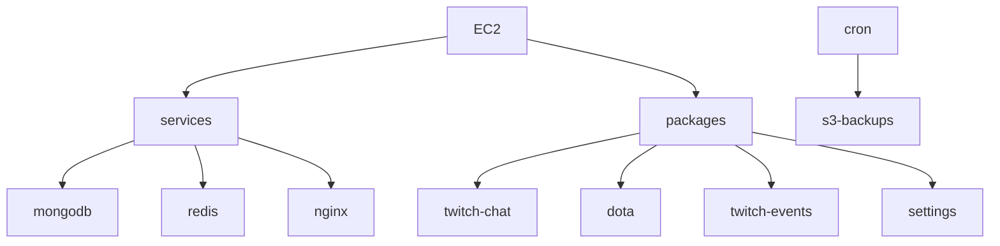

# Dotabod Technical Overview

## Intro

Dotabod is a tool made for players that stream playing Dota 2. It aims to give viewers of the stream more information on the game and also give streamers automated processes connected to game events.

## Business Problem

Streamers have several manual processes:

1. The top viewed streamers would often forget to either block or unblock their hero picks each game, or their in-game minimap, which would lead to "stream sniping" (ie, in game players watching their stream to gain an advantage). Most streamers have to block their picks ~10 times a day.
2. Creating Twitch predictions. This is a native Twitch feature that allows viewers to participate in betting. The streamer would have to manually create the bet, which would lead to viewers spamming in chat waiting for bets to open.
3. Tracking the streamer's MMR (match making rating). MMR is a number that represents a player's skill level and changes after every game. Viewers would constantly ask for the streamer's MMR in chat.
4. Internationalization. The Dota 2 community is very international, and streamers exist in every region. Their viewers desire to interact in their native language with a Twitch bot.
5. 9kmmrbot (competitor) was limited to top 1% Dota players, had only 3 basic features, and was not customizable.

## Impact

1. Worked for all Dota 2 players, not just the top 1%. Gives the small streamers a chance to compete.
2. Fully automated several previously manual processes for streamers and their moderators, reducing their workload
3. Boosting streamer's popularity as they now have standardized tooling that viewers can expect to use on most streams
4. Reducing questions in chat
   1. Win loss for the day
   2. Current MMR
   3. Notable players streamer is playing with
   4. What items other players have
5. Fully localized in collaboration with Dota 2 players in their native languages

## Challenges

- The Dota 2 game client's API is not documented anywhere by Valve
- Trial and error for several solutions to find one that worked for all Dota 2 players, regardless of rank
- Streamers had various setups so the solution had to be flexible, simple, and easy to use
  - Streaming at different monitor resolutions
  - Streaming on different platforms, windows, mac, linux
  - Finding the easiest and most minimal setup process
- Streamers do not want to install a .exe, so the solution had to be minimal and non-intrusive
- Potential for stream sniping if the solution was not robust
- Security in the solution so that no one could abuse the bot
- DDOS protection from the in-game client, as it would send requests every 0.5s per user
- Adoption by streamers. Streamers had to be convinced that the bot was
  - safe to use
  - would not distract from their stream
  - would not be a burden to setup
  - is better than the current tool (9kmmrbot)
- Streamers had many feature requests, and it was difficult to balance feature development with user feedback
- A small minority of "anti-dotabod" viewers who would actively try to sabotage the bot
- API rate limits were easy to hit on Twitch and Supabase
- Monetization was difficult as the majority of users were not streamers

## Technical Implementation

Dotabod started as a small node.js app, and a simple admin dashboard. It has since grown to a large monorepo with 5 microservices, 2 socket servers, a frontend, and a discord server for community support. Overall, the backend architecture of Dotabod is designed to be modular and scalable, allowing for easy expansion and maintenance of the app. The typescript backend is built on-top of Express.js framework and uses MongoDB for data storage, Redis for caching, and Nginx for load balancing. The backend is hosted on AWS EC2 instances and is deployed using Docker.

The dotabod frontend is a typescript web app built using the Next.js framework. The app uses React for rendering UI components and Redux for state management, including several UI libraries such as Tailwindcss and Ant Design, as well as i18next for internationalization and Socket.IO for real-time communication. The project also uses supabasejs as an ORM for database access.

Secrets management uses Doppler, and injects into every Docker build on the fly.

- **Backend**: Node.js, Express.js, MongoDB, Redis, Supabase, Nginx, Docker, hosted on AWS EC2, backups on AWS S3
- **Frontend**: Next.js, Tailwindcss, Ant.design, i18next, Socket.IO, Supabase, NextAuth, hosted and auto deploying with Vercel
- **Other**: Doppler for secrets, New Relic for server monitoring and alerts, Sentry for frontend error tracking, Discord for community support

## Design Tradeoffs

1. Choosing to not translate the homepage or admin dashboard. They are not used by the majority of users. The homepage is only used by new users to sign up for the bot, and the admin dashboard is only used by streamers to configure the bot. The majority of users are viewers who interact with the bot through Twitch chat commands, and the bot is fully translated for them. The website can already be automatically translated through their browser settings.
2. YouTube live integration, although possible, had to be prioritized for a later date, as it would require a lot of development time and would not be used by the majority of users.
3. Serverless architecture was not chosen due to the high cost of running the app on AWS Lambda. The app is already running on AWS EC2 instances, and the cost of running the app on Lambda would be 10x more expensive.
   - Currently receiving 25m requests/month
   - $10/mo for execution time using 128mb memory
   - $5 for 25m lambda executions
   - $25 for 25m API requests via api gateway
   - $40/mo
   - Serverless architecture was not meant to handle high traffic apps, as it would mean keeping the lambda functions warm 24/7

## Success Metrics

1. Number of Twitch streamers using Dotabod
   - 100 signups per day since launch
   - 4,700 total signups
2. Conversion rate: (2,270 / 3,270) \* 100% = 69.43%
   - percentage of users who sign up for Dotabod and end up installing it on their stream
3. Retention rate: (2,670 / 3,270) \* 100% = 81.71%
   - percentage of users who continue to use Dotabod 30 days after signing up.
4. Sign up but never install: (1,480 / 4,750) \* 100% = 31.16%
5. Positive user feedback and testimonials
   - 448 users registered on the Discord server

## Lessons learned

1. API availability: The lack of API documentation from the game developer (Valve) can be a major challenge.
2. Translation: Talk to international users to see what tool they prefer using.
3. User adoption: Convincing streamers to use the tool requires not only providing a useful product but also demonstrating that it is safe, easy to use, and will not detract from the stream.
4. The importance of modularity and scalability in app design to allow for easy expansion and maintenance.
5. The challenges of working with undocumented APIs and the need to be resourceful and persistent in finding solutions.
6. The importance of using best practices for secrets management.
7. The value of continuously learning new technologies and best practices to keep the app up-to-date
8. MongoDB and Supabase were both running out of space because of the large amount of data being stored.
9. Twitch API rate limiting was a major issue that I didn't anticipate.
10. Supabase realtime is not reliable and is not a good solution for real-time communication.
11. Supabase has no data retention policies like mongo does
12. Nginx access logs were taking up 100% of the disk space on the server after a few days

## Changes based on learnings

1. Switched from making API requests to OpenDota using the backend server to making them directly from the frontend, which improved performance and reduced server load. It helped with API rate limiting as well.
2. Successfully applied to become a Twitch Verified Developer, which allowed for more API requests and better support from Twitch.
3. Switched from Lingohub to Crowdin, which ended up being a huge improvement for translators.
4. Dockerized the entire app, which made it easier to deploy and maintain.
5. Conducted user research and made UI UX improvements to make the tool more appealing and user-friendly. Converted the website from light mode to dark mode as it was highly requested.
6. Enabled Node Inspector in production, locked under my EC2 key, so that I could debug memory leaks and performance issues as they happen.
7. Data retention policy for MongoDB and Supabase. MongoDB was storing 300mb of data per day, and Supabase was storing 50mb of data per day. On the free tier this was not sustainable. I implemented a data retention policy to delete old data, and also implemented a data backup policy to store old data on AWS S3.
8. Switched Supabase realtime to native psql triggers
9. Implemented a psql policy time to live for rows in Supabase to offer efficiency when making new queries, and setup a cron job to automatically delete old rows
10. Disabled access logs on nginx to prevent disk space from filling up. Implemented new relic to monitor server performance instead.

## Distribution of learnings

1. Streaming myself coding on Dotabod for over 5 hours a day
   1. Viewers would ask questions about the project, how to interact with the Dota 2 client, and general programming
   2. My answers would be recorded and saved on YouTube and Twitch
2. Interacting with the community through Discord, Twitch chat, Reddit, and Twitter. Writing code samples and tutorials for others to learn from
3. Open sourcing the entire project on GitHub for others to learn from the undocumented Dota 2 API
4. Creating changelogs and release notes for new versions

## YouTube integration implementation plan

### Objectives and success criteria

- Deliver feature parity (or clear MVP subset) for streamers who broadcast on YouTube Live in addition to Twitch.
- Keep the existing Twitch stack stable by isolating changes behind a provider abstraction.
- Preserve latency-sensitive flows (game events → chat/output) with <5s added delay, accounting for YouTube chat polling intervals.
- Track adoption via number of linked YouTube channels, active live chats, and command success/error rates.

### Scope and phased rollout

1. **Foundation (P0)**: OAuth + channel linkage, data model readiness, secrets/infra wiring, basic health checks.
2. **Chat + stream lifecycle (P1)**: Bidirectional chat bridge (commands/responses), live/offline detection, moderation/error handling.
3. **Feature parity (P2)**: Dota-driven automations (predictions/polls, overlays, auto-messages), localization, moderator controls.
4. **Hardening & rollout (P3)**: Observability, rate-limit tuning, canary rollout to a small cohort, documentation and support.

### Architecture approach

- **Provider abstraction**: Introduce a `StreamingProvider` interface in `shared-utils` to unify auth tokens, chat send/receive, and stream status checks. Keep Twitch implementations intact and add a YouTube implementation that plugs into the same sockets used by `packages/twitch-chat`.
- **New packages/services**:
  - `packages/youtube-chat`: Mirrors `twitch-chat` but uses YouTube LiveChat APIs for ingest and message dispatch; reuses shared command handlers where possible.
  - `packages/youtube-events`: Mirrors `twitch-events` for stream lifecycle and channel updates (using `liveBroadcasts`, `videos`, `subscriptions` APIs). Emits the same internal events consumed by downstream services.
- **Sockets and API surface**: Extend existing socket events to include `provider` metadata so frontends and other services can route messages to the correct transport without duplicating handlers.
- **Deployment**: Add Docker targets and compose entries mirroring Twitch services; gate startup on presence of Google credentials to avoid breaking existing environments.

### Authentication and permissions

- Create a Google Cloud project + OAuth client (web app) and store credentials via Doppler alongside Twitch secrets.
- Scopes: `https://www.googleapis.com/auth/youtube.readonly` (live metadata), `https://www.googleapis.com/auth/youtube.force-ssl` (chat read/write—needed instead of broader `.../youtube`), `https://www.googleapis.com/auth/youtube.channel-memberships.creator` if membership-specific features are needed. Re-evaluate if a narrower live-stream scope (e.g., `youtube.liveBroadcast`) is sufficient before requesting broader access.
- Flow: front-end initiates Google OAuth; Supabase `accounts` table already supports generic providers—store `provider: 'youtube'` with `refresh_token`, `access_token`, `expires_at`, `scope`, and channel metadata to disambiguate from any other Google-linked features.
- Token refresh: implement Google OAuth refresh logic in `shared-utils` alongside existing Twitch token helpers; add retry/backoff and revocation detection.

### Data model and configuration

- Users table already has a `youtube` field (channel id/url). Enforce population during linkage; validate channel ownership by comparing OAuth channel id.
- Add configuration fields (Supabase) for YouTube-specific toggles: chat language fallback, poll enablement, command prefixes, rate-limit ceilings.
- Add tables/rows for live chat state if needed (e.g., `youtube_live_chats` storing `liveChatId`, `nextPageToken`, `pollIntervalMs`, last seen message timestamp) to avoid duplicate processing.

### Chat ingestion and command handling (P1)

- Use `liveBroadcasts.list` to find the active broadcast and obtain `liveChatId`.
- Poll `liveChatMessages.list` respecting `pollingIntervalMillis` and page tokens; store `messageId`/timestamp with a short TTL (24–48h) to prevent replays without unbounded growth.
- Normalize inbound messages into the existing command bus (user id, channel id, roles, message text). Map YouTube roles to Twitch equivalents (owner → broadcaster, moderator → moderator, member → sub, none → viewer).
- Outbound messages: use `liveChatMessages.insert`; centralize rate limiting against YouTube Data API quota units (default 10,000/day; `liveChatMessages.list` ~5 units, `liveChatMessages.insert` ~50 units per current docs) and fall back to compact messaging when near limits.
- Moderation: handle errors for slow mode, members-only, or chat disabled; surface disable reasons through the same cache/telemetry used in Twitch (`disable_notifications` equivalents).

### Stream lifecycle and events (P1/P2)

- Detect live/offline via `liveBroadcasts.list` and `videos.list` status; emit internal `stream.online`/`stream.offline` events matching the payload shape from `twitch-events`.
- Track title/category changes via `videos.update` or polling; propagate to overlays and chat announcements.
- Implement health checks (cron) similar to Twitch subscription health: verify token validity, channel linkage, and active liveChatId presence; auto-heal by re-fetching live broadcast.

### Feature parity mapping (P2)

- **Predictions/bets**: YouTube does not expose poll creation via API; offer a manual-prompt flow (announce options in chat and parse reactions/keywords under a feature flag) or disable the feature for YouTube if accuracy is insufficient. Keep Supabase `advanced_bets` logic but flag provider to avoid mixing metrics.
- **Auto chat commands**: Reuse existing handlers (MMR, notable players, items) with provider-aware transport.
- **Overlays and sockets**: Ensure socket payloads include provider/channel identifiers so overlays work cross-platform without duplicating UI logic.
- **Localization**: Reuse existing i18n files; add YouTube-specific system messages (errors, rate-limit notices).

### Observability, reliability, and limits (P3)

- Metrics: poll latency, messages processed/sent, error codes per API, rate-limit headroom, per-channel disable events.
- Logging: standardize Winston context fields (`provider`, `channelId`, `liveChatId`, `error.code`).
- Alerts: trigger when polling falls behind (timestamp gap), repeated auth failures, or message send failures > threshold.
- Quotas: track Google API quotas; add circuit breakers to pause non-essential features when nearing limits.

### Rollout plan

- Internal dogfood on a test channel; record flows and log volumes.
- Beta allowlist (Supabase flag) to enable YouTube per user without affecting Twitch users.
- Gradually expand cohort; monitor metrics and support channels.
- Documentation: add setup guide (creating Google credentials, linking account), update README and dashboard onboarding once stable.

### Risks and mitigations

- **Higher latency from polling**: keep Dota-triggered messages concise, allow configurable batching, and pre-emptively refresh `liveChatId` on reconnect.
- **Quota exhaustion**: cache broadcast/channel metadata aggressively; avoid redundant `liveChatMessages.insert` retries.
- **Token revocation**: health checks plus UI banner; disable features gracefully and request re-auth.
- **Feature gaps vs. Twitch**: define MVP (chat commands + stream status) and stage advanced features after stability metrics are green.

## Technical Overview

### Internal microservices

### External services

### Frontend

